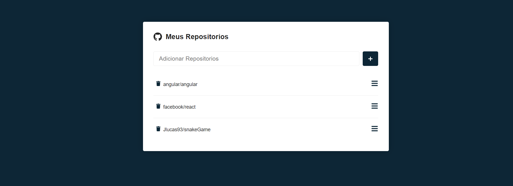

# Sobre o projeto

Um projeto feito em react craido com vite 

O projeto consome a API do github, onde busca um repositório do git pelo seu nome, e irá armazenar no LocalStorage do navegador, assim não persiste mesmo atualizando a página ou fechando o navegador.

 Na tela inicial do app é necessário buscar somente o nome do repositório. Note que o github usa do nome do usuário antes do nome do repositório em si. Ex: facebook/react, angular/angular, Jlucas93/repository consult. 

 Uma vez que o repositpório tenha sido encontrado você pode olhar mais detealhes sobre, incluindo as issues que ele contém. Como mostra a imagem abaixo

